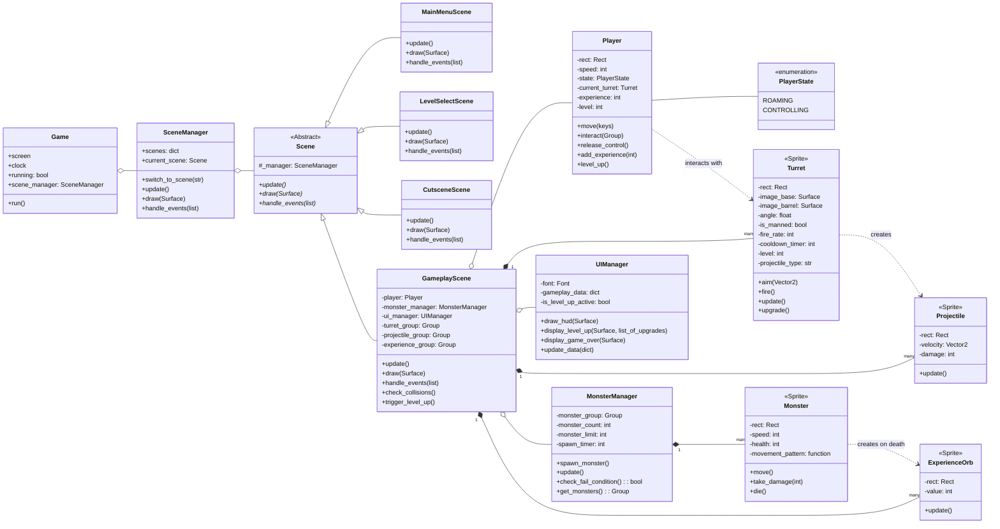

```mermaid
classDiagram
    direction LR

    class Game {
        +screen
        +clock
        +running: bool
        +scene_manager: SceneManager
        +run()
    }

    class SceneManager {
        +scenes: dict
        +current_scene: Scene
        +switch_to_scene(str)
        +update()
        +draw(Surface)
        +handle_events(list)
    }

    class Scene {
        <<Abstract>>
        #_manager: SceneManager
        +update()*
        +draw(Surface)*
        +handle_events(list)*
    }

    class MainMenuScene {
        +update()
        +draw(Surface)
        +handle_events(list)
    }

    class LevelSelectScene {
        +update()
        +draw(Surface)
        +handle_events(list)
    }

    class CutsceneScene {
        +update()
        +draw(Surface)
        +handle_events(list)
    }

    class GameplayScene {
        -player: Player
        -monster_manager: MonsterManager
        -ui_manager: UIManager
        -turret_group: Group
        -projectile_group: Group
        -experience_group: Group
        +update()
        +draw(Surface)
        +handle_events(list)
        +check_collisions()
        +trigger_level_up()
    }

    class Player {
        -rect: Rect
        -speed: int
        -state: PlayerState
        -current_turret: Turret
        -experience: int
        -level: int
        +move(keys)
        +interact(Group)
        +release_control()
        +add_experience(int)
        +level_up()
    }
    
    class PlayerState {
        <<enumeration>>
        ROAMING
        CONTROLLING
    }

    class Turret {
        <<Sprite>>
        -rect: Rect
        -image_base: Surface
        -image_barrel: Surface
        -angle: float
        -is_manned: bool
        -fire_rate: int
        -cooldown_timer: int
        -level: int
        -projectile_type: str
        +aim(Vector2)
        +fire()
        +update()
        +upgrade()
    }

    class Projectile {
        <<Sprite>>
        -rect: Rect
        -velocity: Vector2
        -damage: int
        +update()
    }
    
    class ExperienceOrb {
        <<Sprite>>
        -rect: Rect
        -value: int
        +update()
    }

    class MonsterManager {
        -monster_group: Group
        -monster_count: int
        -monster_limit: int
        -spawn_timer: int
        +spawn_monster()
        +update()
        +check_fail_condition(): bool
        +get_monsters(): Group
    }

    class Monster {
        <<Sprite>>
        -rect: Rect
        -speed: int
        -health: int
        -movement_pattern: function
        +move()
        +take_damage(int)
        +die()
    }

    class UIManager {
        -font: Font
        -gameplay_data: dict
        -is_level_up_active: bool
        +draw_hud(Surface)
        +display_level_up(Surface, list_of_upgrades)
        +display_game_over(Surface)
        +update_data(dict)
    }

    Game o-- SceneManager
    SceneManager o-- Scene
    Scene <|-- MainMenuScene
    Scene <|-- LevelSelectScene
    Scene <|-- CutsceneScene
    Scene <|-- GameplayScene

    GameplayScene o-- Player
    GameplayScene o-- MonsterManager
    GameplayScene o-- UIManager
    GameplayScene "1" *-- "many" Turret
    GameplayScene "1" *-- "many" Projectile
    GameplayScene "1" *-- "many" ExperienceOrb

    Player -- PlayerState
    Player ..> Turret : interacts with

    Turret ..> Projectile : creates

    MonsterManager "1" *-- "many" Monster
    Monster ..> ExperienceOrb : creates on death
```