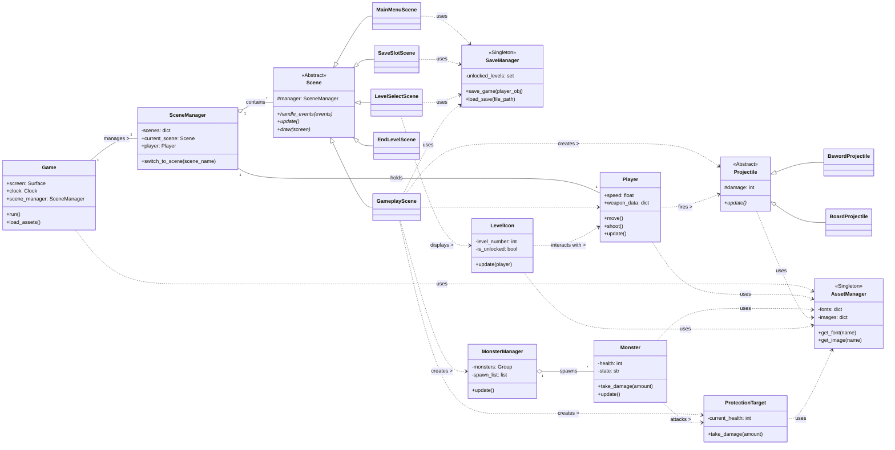

```mermaid
classDiagram
    direction LR

    class Game {
        +screen: Surface
        +clock: Clock
        +scene_manager: SceneManager
        +run()
        +load_assets()
    }

    class AssetManager {
        <<Singleton>>
        -fonts: dict
        -images: dict
        +get_font(name)
        +get_image(name)
    }

    class SaveManager {
        <<Singleton>>
        -unlocked_levels: set
        +save_game(player_obj)
        +load_save(file_path)
    }

    class SceneManager {
        -scenes: dict
        +current_scene: Scene
        +player: Player
        +switch_to_scene(scene_name)
    }

    class Scene {
        <<Abstract>>
        #manager: SceneManager
        +handle_events(events)*
        +update()*
        +draw(screen)*
    }

    class MainMenuScene
    class LevelSelectScene
    class GameplayScene
    class EndLevelScene
    class SaveSlotScene

    class Player {
        +speed: float
        +weapon_data: dict
        +move()
        +shoot()
        +update()
    }

    class MonsterManager {
        -monsters: Group
        -spawn_list: list
        +update()
    }

    class Monster {
        -health: int
        -state: str
        +take_damage(amount)
        +update()
    }

    class Projectile {
        <<Abstract>>
        #damage: int
        +update()*
    }
    class BswordProjectile
    class BoardProjectile

    class ProtectionTarget {
        -current_health: int
        +take_damage(amount)
    }

    class LevelIcon {
        -level_number: int
        -is_unlocked: bool
        +update(player)
    }

    %% --- 關係連結 ---

    Game "1" -- "1" SceneManager : manages >
    Game ..> AssetManager : uses

    SceneManager "1" o-- "*" Scene : contains
    SceneManager "1" -- "1" Player : holds

    Scene <|-- MainMenuScene
    Scene <|-- LevelSelectScene
    Scene <|-- GameplayScene
    Scene <|-- EndLevelScene
    Scene <|-- SaveSlotScene

    GameplayScene ..> Player
    GameplayScene ..> MonsterManager : creates >
    GameplayScene ..> ProtectionTarget : creates >
    GameplayScene ..> Projectile : creates >

    MonsterManager "1" o-- "*" Monster : spawns

    Player ..> Projectile : fires >

    Monster ..> ProtectionTarget : attacks >

    LevelSelectScene ..> LevelIcon : displays >
    LevelIcon ..> Player : interacts with >

    Projectile <|-- BswordProjectile
    Projectile <|-- BoardProjectile

    %% --- 全域單例的依賴關係 ---
    MainMenuScene ..> SaveManager : uses
    SaveSlotScene ..> SaveManager : uses
    LevelSelectScene ..> SaveManager : uses
    GameplayScene ..> SaveManager : uses

    Player ..> AssetManager : uses
    Monster ..> AssetManager : uses
    Projectile ..> AssetManager : uses
    LevelIcon ..> AssetManager : uses
    ProtectionTarget ..> AssetManager : uses
```