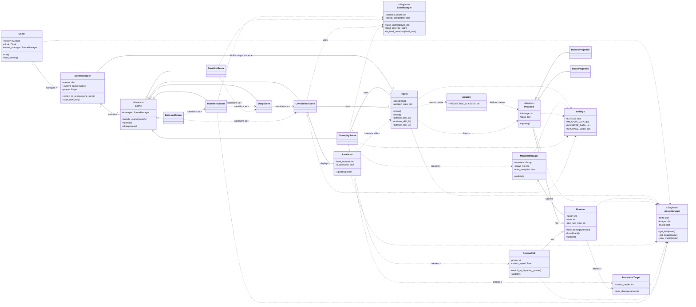

```mermaid
classDiagram
    direction LR

    %% --- Core & Managers ---
    class Game {
        +screen: Surface
        +clock: Clock
        +scene_manager: SceneManager
        +run()
        +load_assets()
    }

    class SceneManager {
        -scenes: dict
        +current_scene: Scene
        +player: Player
        +switch_to_scene(scene_name)
        +start_new_run()
    }

    class AssetManager {
        <<Singleton>>
        -fonts: dict
        -images: dict
        -music: dict
        +get_font(name)
        +get_image(name)
        +play_music(name)
    }

    class SaveManager {
        <<Singleton>>
        -unlocked_levels: set
        -tutorial_completed: bool
        +save_game(player_obj)
        +load_save(file_path)
        +is_level_unlocked(level_num)
    }

    %% --- Abstract Base Classes ---
    class Scene {
        <<Abstract>>
        #manager: SceneManager
        +handle_events(events)*
        +update()*
        +draw(screen)*
    }

    class Projectile {
        <<Abstract>>
        #damage: int
        #data: dict
        +update()*
    }

    %% --- Scenes ---
    class MainMenuScene
    class StoryScene
    class SaveSlotScene
    class LevelSelectScene
    class GameplayScene
    class EndLevelScene

    %% --- Game Entities & Effects ---
    class Player {
        +speed: float
        +weapon_data: dict
        +move()
        +shoot()
        +activate_skill_1()
        +activate_skill_2()
        +activate_skill_3()
    }

    class MonsterManager {
        -monsters: Group
        -spawn_list: list
        -level_multiplier: float
        +update()
    }

    class Monster {
        -health: int
        -state: str
        -stun_end_time: int
        +take_damage(amount)
        +knockback()
        +update()
    }

    class BswordProjectile
    class BoardProjectile

    class ProtectionTarget {
        -current_health: int
        +take_damage(amount)
    }

    class RescueSkill {
        -phase: str
        -current_speed: float
        +switch_to_departing_phase()
        +update()
    }

    class LevelIcon {
        -level_number: int
        -is_unlocked: bool
        +update(player)
    }

    %% --- Helper Modules (Data-only) ---
    class weapon {
        +PROJECTILE_CLASSES: dict
    }
    class settings {
        +LEVELS: dict
        +WEAPON_DATA: dict
        +MONSTER_DATA: dict
        +UPGRADE_DATA: dict
    }

    %% --- Relationships ---
    Game "1" -- "1" SceneManager : manages >
    Game ..> AssetManager : uses

    SceneManager "1" o-- "*" Scene : contains
    SceneManager "1" -- "1" Player : holds unique instance

    Scene <|-- MainMenuScene
    Scene <|-- StoryScene
    Scene <|-- SaveSlotScene
    Scene <|-- LevelSelectScene
    Scene <|-- GameplayScene
    Scene <|-- EndLevelScene

    MainMenuScene ..> StoryScene : transitions to >
    StoryScene ..> LevelSelectScene : transitions to >
    SaveSlotScene ..> StoryScene : transitions to >
    EndLevelScene ..> LevelSelectScene : transitions to >
    EndLevelScene ..> MainMenuScene : transitions to >

    GameplayScene ..> MonsterManager : creates >
    GameplayScene ..> ProtectionTarget : creates >
    GameplayScene ..> RescueSkill : creates >
    GameplayScene "1" -- "1" Player : uses

    MonsterManager "1" o-- "*" Monster : spawns

    Player ..> weapon : uses to create
    weapon ..> Projectile : defines classes
    Player ..> Projectile : fires >

    Projectile --|> Monster : hits
    Monster ..> ProtectionTarget : attacks >
    RescueSkill --|> Monster : hits

    LevelSelectScene "1" o-- "*" LevelIcon : displays >
    LevelSelectScene "1" -- "1" Player : uses
    LevelIcon ..> Player : interacts with >

    Projectile <|-- BswordProjectile
    Projectile <|-- BoardProjectile

    %% --- Singleton / Global Data Dependencies ---
    MainMenuScene ..> SaveManager
    SaveSlotScene ..> SaveManager
    LevelSelectScene ..> SaveManager
    GameplayScene ..> SaveManager

    Player ..> AssetManager
    Monster ..> AssetManager
    Projectile ..> AssetManager
    LevelIcon ..> AssetManager
    ProtectionTarget ..> AssetManager
    RescueSkill ..> AssetManager
    MainMenuScene ..> AssetManager

    Player ..> settings
    MonsterManager ..> settings
    Projectile ..> settings
    GameplayScene ..> settings
    LevelSelectScene ..> settings
```